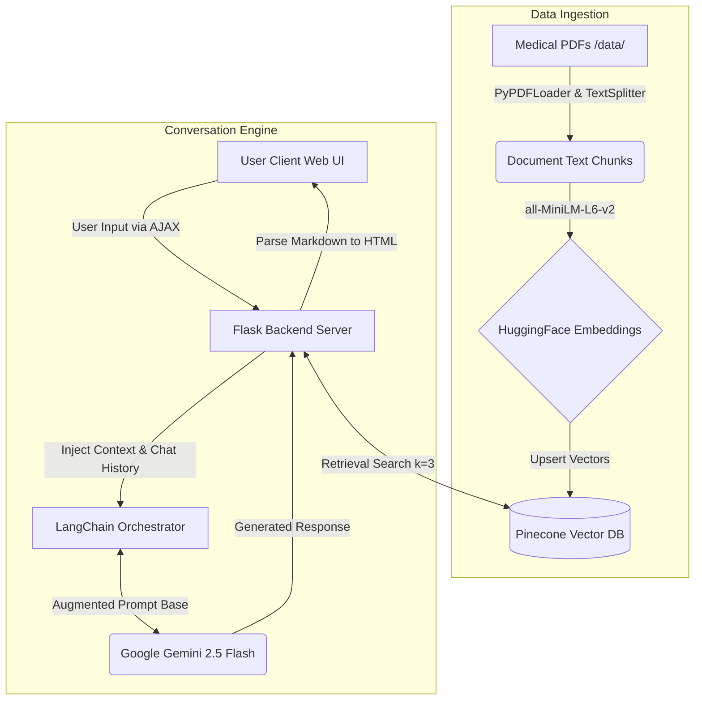

# AI Medical Assistant: RAG-Powered Chatbot

A production-ready medical chatbot built using Large Language Models (LLMs), LangChain, Pinecone, and Flask. This system leverages Retrieval-Augmented Generation (RAG) to dynamically retrieve critical medical knowledge and generate highly accurate, contextual answers. The application features a modern premium Glassmorphism UI and is containerized with Docker, making it completely deployable on AWS or any cloud hosting service.

##  System Architecture

The application is built on two primary workflows:
1. **Offline Ingestion Pipeline**: Reads your custom medical PDFs, generates semantic embeddings locally, and uploads them to a vector database.
2. **Real-time Inference Pipeline**: Queries the vector database for the most relevant context and streams it along with conversational history to Google's Gemini model.



##  Technology Stack

* **Backend:** Flask, Python 3.10
* **Frontend:** HTML5, CSS3 (Custom Glassmorphism styling), JavaScript, jQuery, marked.js
* **LLM Engine:** ChatGoogleGenerativeAI (`gemini-2.5-flash`)
* **LLM Orchestration:** LangChain
* **Vector Database:** Pinecone (Serverless)
* **Embedding Model:** HuggingFace `sentence-transformers/all-MiniLM-L6-v2`
* **Containerization:** Docker

##  Project Structure

```text
├── .env                  # Environment variables (API Keys)
├── Dockerfile            # Container configuration
├── app.py                # Main Flask application and Engine logic 
├── requirements.txt      # Python dependencies
├── store_index.py        # Independent script to process data/ into Pinecone
├── data/                 # Directory reserved for your custom PDF medical text files
├── src/                  
│   ├── helper.py         # Utility functions: extraction, chunking, and embeddings
│   └── prompt.py         # System conversational rules & Prompt engineering
├── static/               
│   └── style.css         # Custom frontend CSS utilizing fluid gradients & glassmorphism
└── templates/
    └── chat.html         # Frontend interface
```

##  Getting Started

### Prerequisites
* Python 3.10+
* Accounts for [Pinecone](https://www.pinecone.io/) and [Google AI Studio (Gemini)](https://aistudio.google.com/)

### Installation

1. **Clone the repository:**
   ```bash
   git clone <your-repo-link>
   cd MedicalChatbot-with-LLMs-LangChain-Pinecone-Flask-AWS
   ```

2. **Create a virtual environment & install dependencies:**
   ```bash
   python -m venv venv
   source venv/bin/activate  # On Windows: venv\Scripts\activate
   pip install -r requirements.txt
   ```

3. **Configure Environment Variables:**
   Create a `.env` file in the root directory and add your API keys:
   ```env
   PINECONE_API_KEY=your_pinecone_api_key_here
   GOOGLE_API_KEY=your_google_api_key_here
   ```

4. **Prepare the Data Index:**
   Add your medical PDFs into the `data/` folder, then run the indexing script to generate embeddings and push them to Pinecone:
   ```bash
   python store_index.py
   ```

5. **Run the Application:**
   ```bash
   python app.py
   ```
   Open your browser and navigate to `http://localhost:8080/`.

##  Docker Deployment

This application includes a production-ready `Dockerfile`. You can instantly deploy this containerized app to any container solution (like Render, Hugging Face Spaces, AWS ECS, or EC2).

```bash
# Build the Docker image
docker build -t medical-chatbot .

# Run the container locally passing env keys
docker run -d -p 8080:8080 --env-file .env medical-chatbot
```
